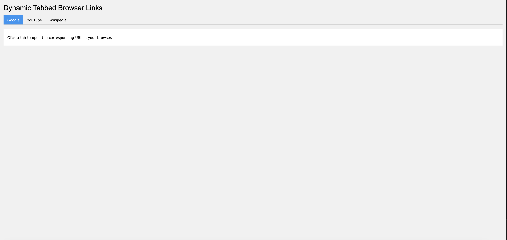

# TabLinker

**TabLinker** is a lightweight web application that dynamically creates a tabbed interface using W3.CSS, allowing users to open browser links specified in a `settings.json` file.

## Features
- Dynamic tab generation from a JSON configuration file.
- Clean and responsive interface powered by W3.CSS.
- Easily customizable for any set of URLs.

## Demo
Click a tab to open the associated URL in a new browser tab.

  

## Getting Started

### Prerequisites
- A web browser.
- Basic knowledge of HTML and JSON for customization.

### Installation
1. Clone this repository:
   ```bash
   git clone https://github.com/pingleware/tablinker.git
   cd tablinker
   ```
2. Create or edit the `settings.json` file to define your tabs and URLs:
   ```json
   {
     "tabs": [
       { "name": "Google", "url": "https://www.google.com" },
       { "name": "YouTube", "url": "https://www.youtube.com" },
       { "name": "Wikipedia", "url": "https://www.wikipedia.org" }
     ]
   }
   ```
3. Open the `index.html` file in your favorite browser.

### Usage
1. Add your desired tabs and URLs to the `settings.json` file.
2. Open `index.html` in a browser.
3. Click a tab to open the corresponding URL in a new browser tab.

## File Structure
```
tablinker/
├── index.html        # Main HTML file
├── settings.json     # JSON file defining tabs and URLs
└── README.md         # Project documentation
```

## Customization
- **Styling**: Modify the W3.CSS classes in `index.html` to change the design.
- **Behavior**: Adjust the JavaScript logic to fit your needs (e.g., open URLs in the same tab or iframe).

## Contributing
Contributions are welcome! Feel free to submit issues or pull requests for improvements.

## License
This project is licensed under the [BSL License](LICENSE).

## Acknowledgments
- [W3.CSS](https://www.w3schools.com/w3css/) for the responsive design framework.  
- Community feedback and inspiration.  

---

Enjoy using **TabLinker**! 😊